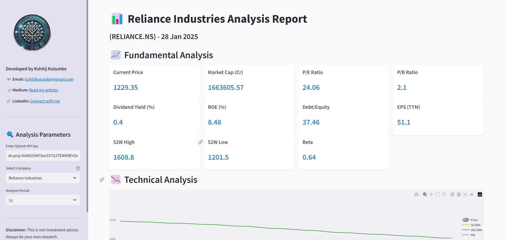

# IntelliStock: Advanced Equity Analysis


**IntelliStock** is a powerful, AI-driven stock analysis tool designed for Indian equities. It provides **fundamental analysis**, **technical analysis**, and **AI-powered recommendations** for any given Indian stock. Built with Python, Streamlit, and OpenAI's GPT-4, this app is perfect for investors, traders, and financial enthusiasts.


## Features

- **Fundamental Analysis**:
  - Key metrics: P/E Ratio, P/B Ratio, Dividend Yield, ROE, Debt/Equity, EPS, and more.
  - Real-time data for accurate insights.

- **Technical Analysis**:
  - Interactive candlestick charts with moving averages (SMA, EMA).
  - Technical indicators: RSI, MACD, Bollinger Bands, Stochastic Oscillator, VWAP, and OBV.

- **AI-Powered Recommendations**:
  - GPT-4 provides professional stock recommendations based on fundamental and technical analysis.
  - Includes price targets, risk assessment, and time horizon.

- **User-Friendly Interface**:
  - Clean, modern, and responsive design.
  - Easy-to-use dropdown for selecting major Indian companies.


## How to Use

1. **Select a Company**:
   - Choose a company from the dropdown menu (e.g., Reliance Industries, TCS, HDFC Bank).

2. **Choose Analysis Period**:
   - Select the time period for analysis (e.g., 1 month, 6 months, 1 year).

3. **Run Analysis**:
   - Click the "Run Analysis" button to generate insights.

4. **View Results**:
   - Explore fundamental metrics, technical charts, and AI recommendations.


## Demo

  
*Example: Analysis of Reliance Industries*


## Installation

To run this app locally, follow these steps:

1. **Clone the Repository**:
   ```bash
   git clone https://github.com/kshitijkutumbe/intellistock-app.git
   cd intellistock-app
   ```

2. **Install Dependencies**:
   ```bash
   pip install -r requirements.txt
   ```

3. **Run the App**:
   ```bash
   streamlit run app.py
   ```

4. **Access the App**:
   - Open your browser and go to `http://localhost:8501`.

---

## Deployment

Deploy this app to **Streamlit Community Cloud** for free:

1. Push your code to a GitHub repository.
2. Go to [Streamlit Community Cloud](https://share.streamlit.io/).
3. Connect your GitHub account and deploy the app.

Once deployed, you'll get a public URL like `https://intellistock-app.streamlit.app/`.

---

## Technologies Used

- **Python**: Core programming language.
- **Streamlit**: For building the web app.
- **yfinance**: For fetching stock data.
- **TA-Lib**: For technical indicators.
- **Plotly**: For interactive charts.
- **OpenAI GPT-4**: For AI-powered recommendations.

---

## About the Developer

**Kshitij Kutumbe**  
- 📧 Email: [kshitijkutumbe@gmail.com](mailto:kshitijkutumbe@gmail.com)  
- 📝 Medium: [Read my articles](https://kshitijkutumbe.medium.com/)  
- 🔗 LinkedIn: [Connect with me](https://www.linkedin.com/in/kshitijkutumbe/)  

---

## License

This project is licensed under the MIT License. See the [LICENSE](LICENSE) file for details.

---

## Disclaimer

This app is for educational and informational purposes only. It does not provide financial advice. Always consult a certified financial advisor before making investment decisions.

---
```

---


